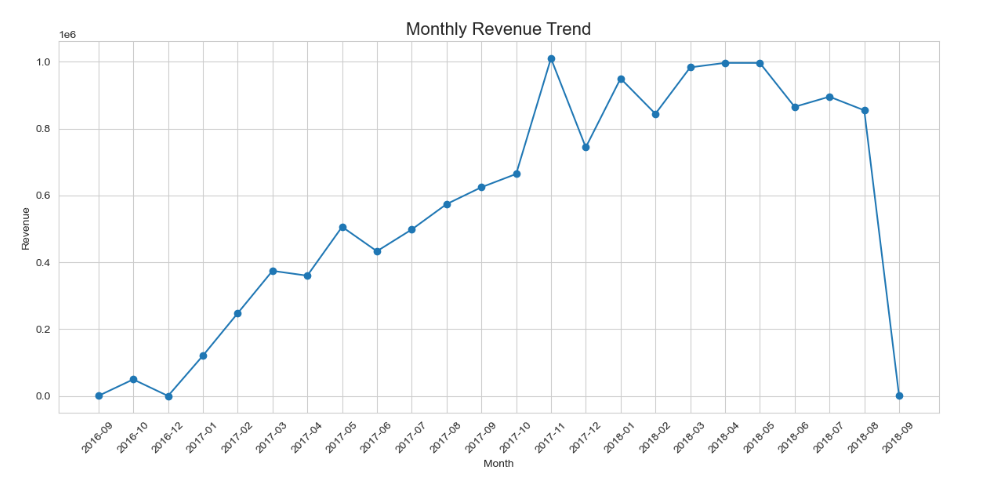
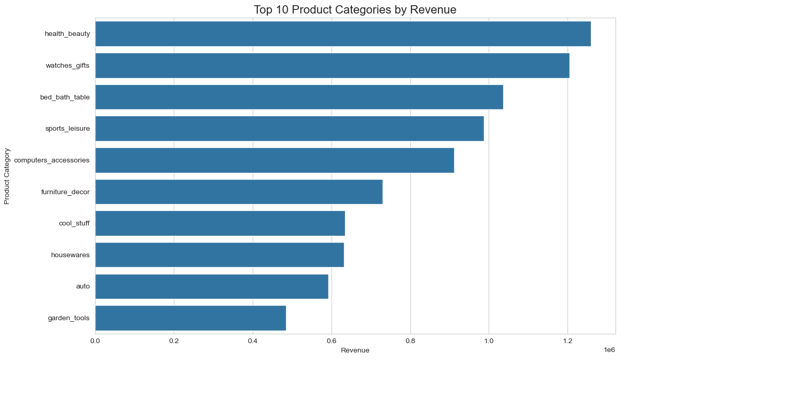
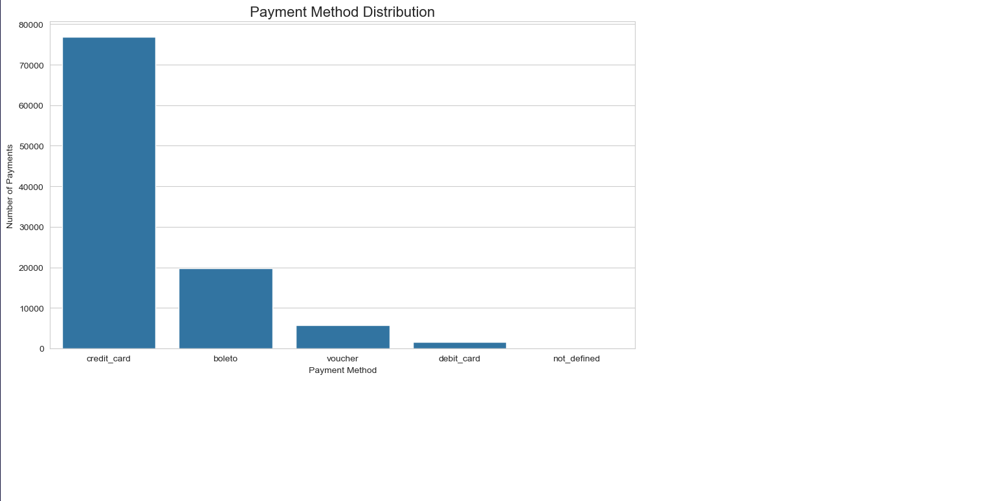
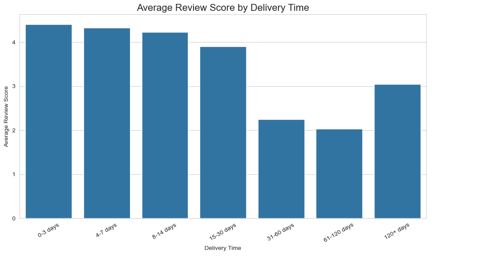
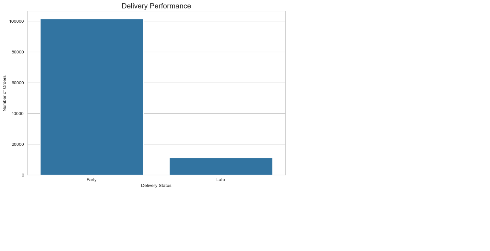

# E-Commerce Customer Behavior & Sales Analysis

An end-to-end **Exploratory Data Analysis (EDA)** project using the **Olist Brazilian E-Commerce Public Dataset**.

## 📌 Project Overview

This project explores real-world e-commerce data to understand sales trends, product performance, customer behavior, payment preferences, delivery performance, and customer satisfaction.

The project was developed as part of my learning journey through the **IBM Machine Learning Professional Certificate**, with a focus on applying exploratory data analysis techniques to a real-world multi-table dataset.

## 🎯 Objectives

* Understand and inspect the structure of real-world e-commerce data
* Identify missing values and duplicate records
* Perform data cleaning and preprocessing
* Combine multiple relational datasets
* Analyze sales and revenue trends
* Identify high-performing product categories
* Analyze customer payment behavior
* Evaluate delivery performance
* Analyze customer review scores
* Explore relationships between delivery time and customer satisfaction
* Generate actionable business insights

## 🛠️ Tech Stack

* **Python**
* **Pandas**
* **NumPy**
* **Matplotlib**
* **Seaborn**
* **Jupyter Notebook**

## 📊 Dataset

The project uses the **Olist Brazilian E-Commerce Public Dataset**.

The analysis uses the following relational datasets:

* Orders
* Customers
* Order Items
* Payments
* Reviews
* Products
* Product Category Translation

The geolocation dataset was excluded from the core analysis because it was not required for the selected business questions.

## 🔄 EDA Workflow

```text
Data Loading
     ↓
Data Inspection
     ↓
Missing Value Analysis
     ↓
Duplicate Analysis
     ↓
Data Cleaning
     ↓
Data Integration
     ↓
Feature Engineering
     ↓
Univariate Analysis
     ↓
Bivariate Analysis
     ↓
Correlation Analysis
     ↓
Business Insights
```

## 🔍 Key Analysis Areas

### Sales Trends

Analyzed monthly order volume and revenue trends to understand how e-commerce activity changed over time.

### Product Performance

Identified the highest-revenue product categories and the categories with the highest number of orders.

### Payment Behavior

Analyzed the distribution and total value of different payment methods.

### Delivery Performance

Compared early, on-time, and late deliveries and analyzed delivery-time distributions.

### Customer Satisfaction

Explored review-score patterns and examined the relationship between delivery time and customer satisfaction.

### Geographic Analysis

Analyzed revenue and order volume across Brazilian states.

## 📈 Key Findings

* Approximately **99K orders** are present in the dataset.
* The average customer review score is approximately **4.09/5**.
* The average delivery time is approximately **12.47 days**.
* **Health & beauty** is among the highest-revenue product categories.
* **Credit card** is the dominant payment method.
* **São Paulo (SP)** is the largest revenue-generating state.
* Longer delivery times are associated with **lower customer review scores**.
* Revenue and order volume are concentrated in a relatively small number of product categories and states.

> Note: The final period in the dataset is incomplete, so it should not be interpreted as a complete monthly performance period.

## 📷 Visualizations

### Monthly Revenue Trend



### Top 10 Product Categories by Revenue



### Payment Method Distribution



### Delivery Performance



### Average Review Score by Delivery Time



## 💡 Business Recommendations

1. Prioritize inventory and seller capacity for high-revenue product categories.
2. Monitor delivery SLAs because longer delivery times are associated with weaker customer ratings.
3. Optimize operations in high-revenue states while identifying growth opportunities in smaller markets.
4. Maintain strong credit-card checkout performance while evaluating opportunities to improve alternative payment adoption.

## 🚀 Future Machine Learning Extensions

This EDA can serve as a foundation for future machine learning projects such as:

* Delivery delay prediction
* Customer review-score prediction
* Customer segmentation
* Product demand forecasting

## 📁 Project Structure

```text
ecommerce-customer-behavior-eda/
│
├── EDA.ipynb
├── README.md
├── .gitignore
└── charts/
    ├── monthly_revenue.png
    ├── top_categories_revenue.png
    ├── payment_methods.png
    ├── delivery_performance.png
    └── delivery_vs_review.png
```

## 📚 Learning Context

This project demonstrates practical application of:

**Data Cleaning → Data Exploration → Visualization → Statistical Analysis → Business Insight Generation**

It was built to strengthen my foundations in **Exploratory Data Analysis as part of my Machine Learning learning path**.

## 👤 Author

**Dipanshu**

B.Tech CSE — AI/ML
